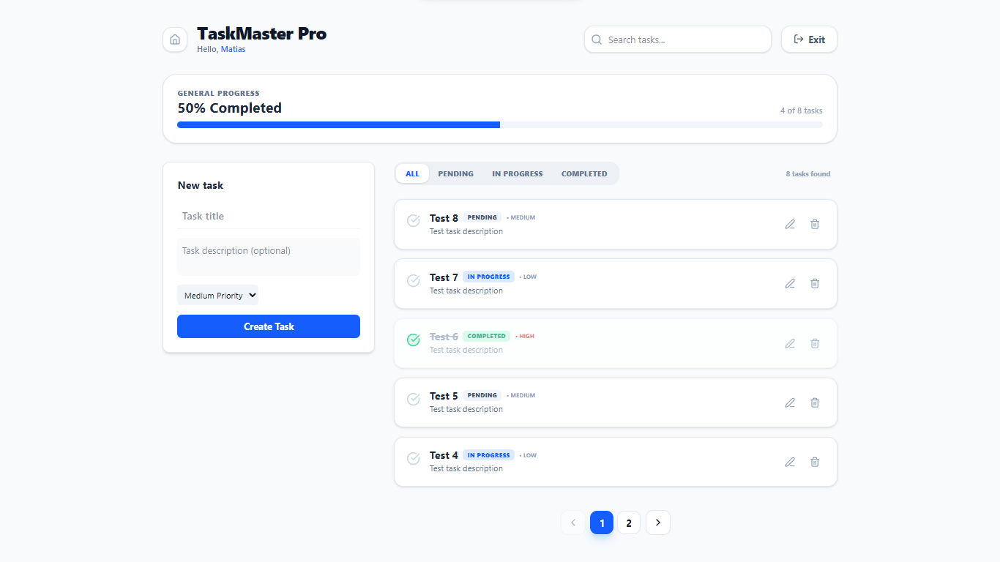

# 💻 TaskMaster Pro - Frontend Client

## 🌐 Live Demo & Backend
* **Live Application:** [🚀 View Live Demo](https://tm-private.vercel.app)
  (If the site doesn't load wait until the server starts again, this is a free host after all.)
* **Backend API Repository:** [⚙️ TaskMaster Pro Backend](https://github.com/MatiRaimondi1/Task-Master-Server)

---

## 📸 Screenshot



---

## 🎨 UI/UX Features

* **Dynamic Auth Flow:** Conditional rendering for Login, Registration, and a specialized **Email Verification UI**.
* **Smart Dashboard:** Real-time task filtering, priority tagging, and progress tracking.
* **Responsive Design:** Fully optimized for Mobile, Tablet, and Desktop using Tailwind CSS.
* **Modern Feedback:** Integrated toast notifications for every user action (success, errors, loading states).
* **Glassmorphism UI:** Clean aesthetic using backdrop blurs, slate-based color palettes, and Lucide icons.

---

## 🛠️ Tech Stack

* **Framework:** React 18 (Vite)
* **Styling:** Tailwind CSS
* **Icons:** Lucide React
* **State Management:** React Context API (Auth & Tasks)
* **Routing:** React Router Dom v6
* **HTTP Client:** Axios
* **Notifications:** React Hot Toast
* **Animations:** Tailwind Animate & Transitions

---

## 🏗️ Architecture Highlights

### Context API & Global State
The app uses a dual-context architecture to maintain a clean separation of concerns:
* **AuthContext:** Manages user session, JWT persistence in LocalStorage, and the multi-step verification flow.
* **TaskContext:** Handles real-time CRUD operations, ensuring the UI stays in sync with the Backend API.

### Protected Routing
Implemented custom route guards to prevent unauthenticated users from accessing the Dashboard, redirecting them automatically to the Landing or Login pages.

### Verification UX
A custom 6-digit input interface designed to handle code entry after registration, providing a seamless "verify-to-unlock" experience.

---

## 📡 Frontend Endpoints (Routes)

| Route | Access | Description |
| :--- | :--- | :--- |
| `/` | Public | Landing page with product highlights |
| `/login` | Public | Secure entry for existing users |
| `/register` | Public | Account creation & Verification UI |
| `/dashboard` | Private | Main task management interface |

---

## ⚙️ Environment Variables

To connect this frontend with the API, create a `.env` file in the root directory:

```env
VITE_API_URL=https://your-backend.com/api

```

---

## 🚀 Local Setup

1. **Clone the repository:**
```bash
git clone https://github.com/MatiRaimondi1/Task-Master-Client.git
cd task-master-client

```


2. **Install dependencies:**
```bash
npm install

```


3. **Configure environment:**
Create a `.env` file and set your `VITE_API_URL`.
4. **Start development server:**
```bash
npm run dev

```


5. **Build for production:**
```bash
npm run build

```


---

## 📝 Author

Developed by **Matias Raimondi** as part of a Fullstack Portfolio Project.
